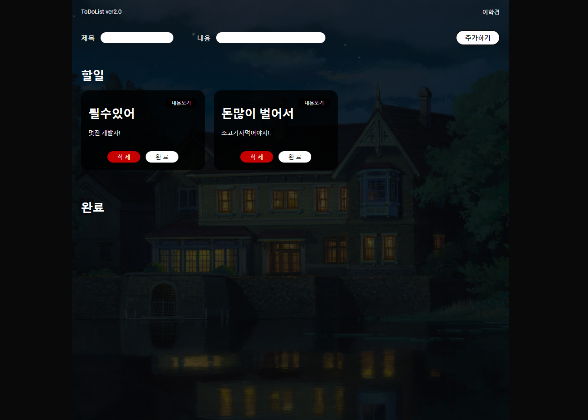

# todolist 만들기 with Redux

Redux,react-router-dom,styled-components를 활용하여 간단한 todolist를 만들었습니다.
 
 

### **이미지 클릭시 링크로 이동!**

 
 

# 폴더구조

- src

  - assets
  - components
    - Form.jsx
    - Header.jsx
    - Layout.jsx
    - List.jsx
  - pages
    - Details.jsx
    - Home.jsx
  - redux
    - config
      - configstore.js
    - modules
      - todos.js
  - shared
    - Router.jsx
  - App.js
  - index. js

   

# features : 구현 기능

- Create Todo : 투두 만들기
- Read Todos, Todo : 투두 목록, 상세페이지 읽기
- Update Todo : 투두 업데이트(완료, 취소)
- Delete Todo : 투두 삭제

# 느낀점

- redux를 통해서 전역으로 상태를 관리를 해서 기존 리액트로만 했을때의 문제점인 `props drilling`을 해결할 수 있어서 좋았다.
- 이번프로젝트를 통해서 useState()훅 사용보다 redux로 state를 관리하는게 훨씬 편하다는것을 느꼈다.
- map메서드 사용할때 key 넣는 것을 생활화 하자.
- console.log를 통해서 코드의 흐름을 잘 파악하자.
